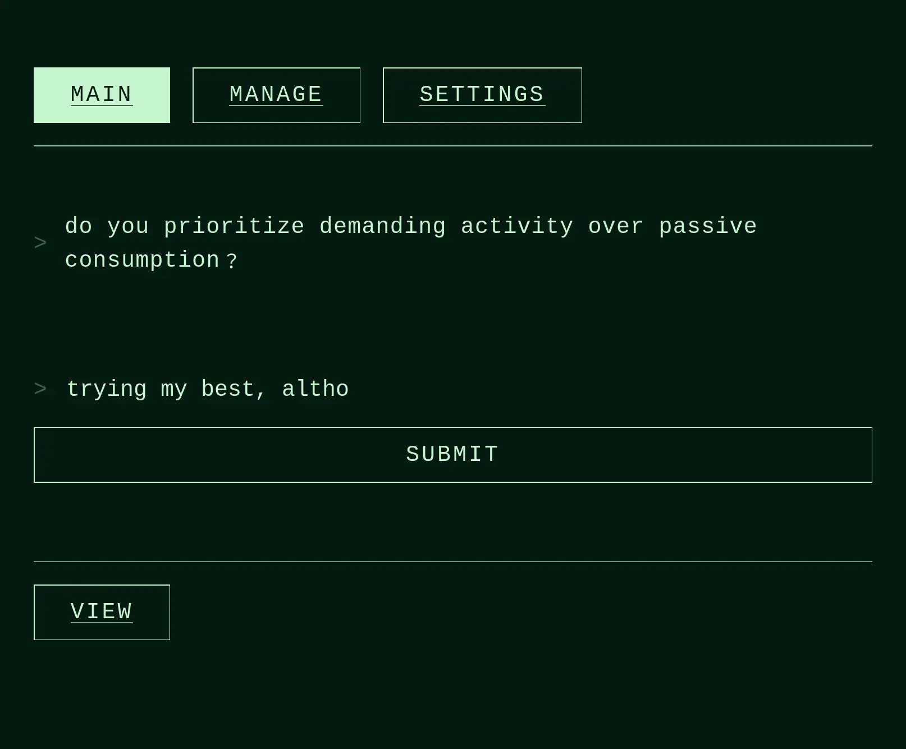

# Local-First Habits and Checks



A queue-based habit prompter. All data stored locally in IndexedDB with optional Dexie Cloud sync.

## Concept

Each **prompt** is a text question or habit check with an **interval** (in days). The main view works through a queue of all due prompts — those not seen within their interval. After answering, the prompt leaves the queue until it is due again.

- `interval: 1` → shown daily
- `interval: 7` → shown once a week
- etc.

## Data Model

```ts
interface Prompt {
  id?: string
  prompt: string       // the text shown to the user
  interval: number     // days between appearances
  createdAt: Date
  lastShownAt?: Date
  answers: TextAnswer[]
}

interface TextAnswer {
  timestamp: Date
  text: string
}
```

## Queue Logic

On load, all prompts whose `lastShownAt` is older than `interval` days (or never shown) are collected into a queue and worked through one by one.

## Data Import / Export

Settings → Export as JSON / Import from JSON. The export format:

```json
{
  "exportDate": "2026-01-01T00:00:00.000Z",
  "version": "3.0",
  "entities": [
    {
      "prompt": "What are you grateful for today?",
      "interval": 1,
      "createdAt": "2026-01-01T00:00:00.000Z",
      "answers": []
    }
  ]
}
```

A demo file showing the structure can be downloaded from Settings.

## Tech Stack

- Vue 3 + TypeScript
- Vite + PWA
- Dexie.js (IndexedDB)
- Dexie Cloud (optional sync)
- Vue Router

## Setup

```sh
npm install
```

```sh
npm run dev       # dev server
npm run build     # production build
npm run lint      # lint
```

## IDE

[VSCode](https://code.visualstudio.com/) + [Volar](https://marketplace.visualstudio.com/items?itemName=Vue.volar)
